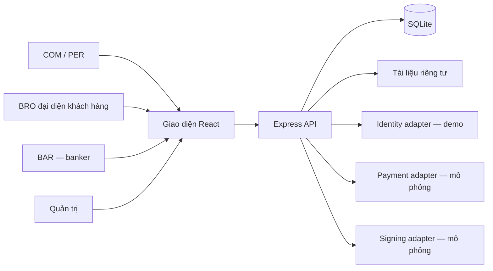

# Lending Hub — kiến trúc phiên bản trải nghiệm

React + Vite cung cấp giao diện tiếng Việt responsive. Express phục vụ API và frontend đã build trên cùng origin. SQLite lưu dữ liệu bền vững, bật foreign keys và WAL; tài liệu nằm trong thư mục riêng, tải qua API kiểm tra quyền. Không có đăng nhập thật trong phiên bản được yêu cầu.

## Mô hình dữ liệu

| Bảng | Vai trò |
| --- | --- |
| users | Vai trò và alias duy nhất, ngẫu nhiên 1–9999 cho mỗi loại |
| loans | Nhu cầu, tài chính, dữ liệu riêng, sự đồng ý, trạng thái, đề xuất được chọn |
| documents | Metadata tệp và mã lưu trữ ngẫu nhiên |
| proposals | Banker, lãi suất/năm, phí cố định, điều kiện, thời gian; duy nhất mỗi banker/hồ sơ |
| contracts | Điều khoản được chấp thuận và phiên bản mô phỏng |
| ledger | Cọc/hoàn cọc/phí; mọi bút toán hiện tại đều là simulation |
| progress | Mốc xử lý, nội dung, người thực hiện và thời gian |
| appointments | Lịch ký và xác nhận của khách hàng |
| notifications | Thông báo riêng từng người dùng |
| audit | Nhật ký thao tác và quyết định xử lý cọc |
| products | Gói vay do banker cung cấp |

Các thao tác nghiệp vụ nhiều bảng chạy trong transaction. Tiền dùng số nguyên VNĐ; lãi suất là %/năm. Không cộng phí banker vào phí nền tảng một cách ngầm định. Alias không chứa tên ngân hàng; hồ sơ do BRO gửi mang alias BRO và giữ loại người vay COM/PER riêng.

## Quy tắc chuyển trạng thái

`submitted → offers_received → selected → in_review → approved → appointment → disbursed → completed`

- Nhiều banker được gửi đề xuất khi hồ sơ còn mở. Bản demo tự ghi cọc mô phỏng trong cùng transaction trước khi công bố đề xuất.
- Chỉ chủ hồ sơ được lựa chọn. Khi chọn, đề xuất còn lại đóng và cọc của banker không được chọn được hoàn mô phỏng.
- Chỉ bắt đầu thẩm định sau khi chấp thuận điều khoản, mô phỏng chữ ký và cọc khách hàng.
- Chỉ banker được chọn được cập nhật, phê duyệt, đặt lịch và báo giải ngân.
- Khách hàng phải xác nhận lịch trước khi banker báo giải ngân; phải xác nhận nhận vốn trước khi hoàn tất.
- Hủy trước giải ngân chuyển cọc đang giữ sang `review_required`. Quản trị ghi căn cứ và quyết định mô phỏng; không tự động tịch thu cọc.
- Thời hạn được tính từ lần bắt đầu thẩm định, không kéo dài khi banker đăng cập nhật. Bản demo hiển thị quá hạn; chưa có cron hay chế tài tự động.

## Ranh giới bản trải nghiệm

Bộ chọn tài khoản là cơ chế mô phỏng, không phải xác thực. Endpoint danh sách tài khoản và quyền quản trị được cố ý mở để thử nhiều vai trò. Kiểm tra quyền backend theo danh tính đang chọn có ý nghĩa với quy trình, nhưng bất kỳ khách tham quan nào cũng có thể đổi danh tính. Không sử dụng hồ sơ thật trên bản công khai này.

Thông tin riêng và file không xuất hiện trong feed. Chủ hồ sơ, quản trị và banker được chọn sau sự đồng ý được xem qua API. Không có email/SMS thật, không tích hợp CIC/ngân hàng, chữ ký số hay cổng thanh toán. Thông báo nằm trong ứng dụng và tải lại khi có thao tác/chuyển tài khoản; chưa cập nhật realtime giữa hai trình duyệt.

Mức cọc banker 1 triệu, khách hàng 3 triệu, dự toán thẩm định 2 triệu và phí nền tảng 0,5% là tham số minh họa, chưa phải chính sách thương mại đã được chốt. Trong demo phí dịch vụ được ghi riêng, cọc được hoàn toàn bộ; không tự động khấu trừ dự toán thẩm định. Chưa có đối soát hóa đơn, thuế, trả góp hoặc biểu phí thực tế.

## Điểm tích hợp vận hành thật

1. Thay `resolveIdentity` bằng xác thực server-side, session cookie HttpOnly/Secure, CSRF, xác minh vai trò, tổ chức và phân quyền quản trị. Bỏ endpoint demo và bộ chọn tài khoản.
2. Chuyển SQLite sang PostgreSQL và object storage khi cần nhiều instance. Bổ sung migration có version, mã hóa dữ liệu nhạy cảm, quét tài liệu và quy tắc lưu/xóa dữ liệu.
3. Tích hợp chữ ký số/hợp đồng điện tử bằng provider đã được thẩm định; lưu bản hợp đồng, hash tài liệu, bằng chứng ký và webhook được xác minh.
4. Thay payment adapter bằng provider hợp lệ. Tạo payment intent/pending, xác minh webhook, idempotency key, đối soát và hoàn tiền. Không gọi mạng bên trong transaction SQLite, không tin xác nhận từ browser. Quy định đơn vị nắm giữ tiền phải được xác định trước khi thu cọc thật.
5. Bổ sung người chịu trách nhiệm xử lý chậm hạn, gia hạn có đồng thuận, tranh chấp và bằng chứng giải ngân. Banker báo giải ngân chưa đủ để kết luận khách hàng đã nhận tiền.
6. Rà soát pháp lý Việt Nam cho mô hình môi giới tín dụng, phí, sự ủy quyền của banker/BRO, dữ liệu cá nhân, hợp đồng điện tử, chữ ký số và cơ chế cọc. Đây là việc cần chuyên gia pháp lý, chưa phải kết luận về tính hợp pháp của mô hình.

Tài liệu này mô tả thiết kế riêng theo yêu cầu kinh doanh. Chưa có nghiên cứu độc lập hay xác minh mô hình Smart Lend.
